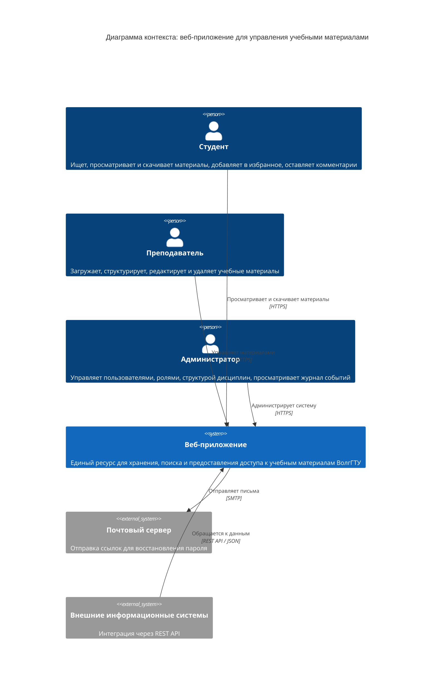
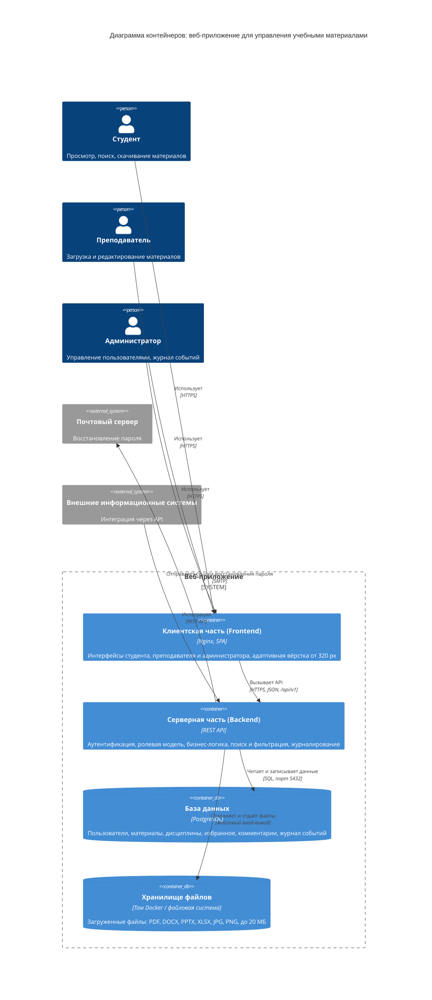
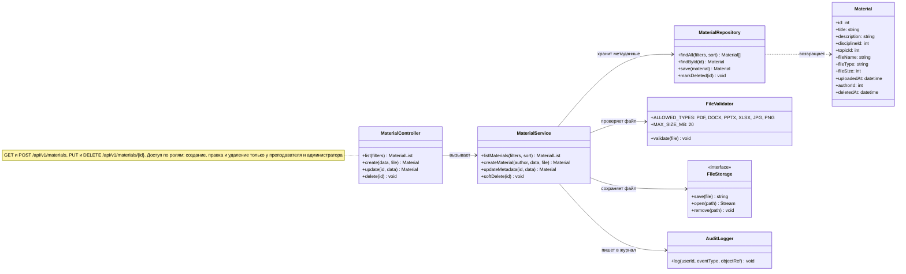
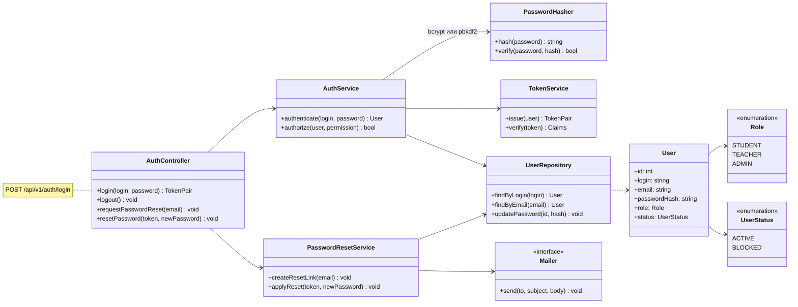
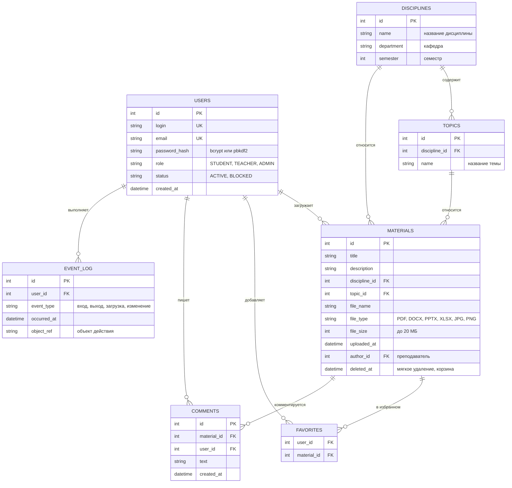
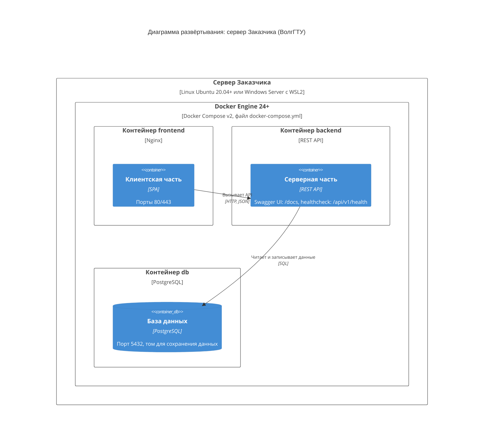

# Архитектура веб-приложения для управления учебными материалами (C4)

Диаграммы построены по модели [C4](https://c4model.com/) и описаны на Mermaid — GitHub отображает их прямо в этом файле.

## Уровень 1. Контекст системы

Кто и как взаимодействует с веб-приложением (см. раздел 3.1 ТЗ).



## Уровень 2. Контейнеры

Из каких частей состоит веб-приложение (см. раздел 3.2 ТЗ).



## Уровень 3. Компоненты серверной части

Из каких модулей состоит Backend (функциональные подсистемы из раздела 4.1 ТЗ).

```mermaid
C4Component
    title Диаграмма компонентов: серверная часть (Backend)

    Container(frontend, "Клиентская часть (Frontend)", "Nginx, SPA", "Интерфейсы трёх ролей")
    ContainerDb(db, "База данных", "PostgreSQL", "Пользователи, материалы, журнал событий")
    ContainerDb(files, "Хранилище файлов", "Том Docker", "Файлы учебных материалов")
    System_Ext(mail, "Почтовый сервер", "Восстановление пароля")

    Container_Boundary(backend, "Серверная часть (Backend)") {
        Component(auth, "Идентификация и авторизация", "REST API", "Вход по логину и паролю, хеширование паролей, токены JWT, ролевая модель, восстановление пароля")
        Component(materials, "Управление материалами", "REST API", "Создание, редактирование, удаление (в корзину) и просмотр материалов")
        Component(search, "Поиск и фильтрация", "REST API", "Полнотекстовый поиск с морфологией русского языка, фильтры, сортировка")
        Component(users, "Управление пользователями", "REST API", "Регистрация, смена ролей, блокировка, удаление")
        Component(filestore, "Хранение и управление файлами", "Модуль", "Проверка формата и размера (до 20 МБ), сохранение и выдача файлов")
        Component(audit, "Журналирование действий", "Модуль", "Запись входов, изменений материалов, загрузок, изменений учётных записей")
    }

    Rel(frontend, auth, "Вход, восстановление пароля", "HTTPS, /api/v1/auth")
    Rel(frontend, materials, "Работа с материалами", "HTTPS, /api/v1/materials")
    Rel(frontend, search, "Поиск и фильтры", "HTTPS")
    Rel(frontend, users, "Управление пользователями", "HTTPS, /api/v1/users")

    Rel(materials, filestore, "Сохраняет и читает файлы")
    Rel(materials, audit, "Фиксирует действия")
    Rel(users, audit, "Фиксирует действия")
    Rel(auth, audit, "Фиксирует входы и выходы")

    Rel(auth, mail, "Отправляет ссылку восстановления", "SMTP")
    Rel(filestore, files, "Читает и записывает", "Файловый ввод-вывод")
    Rel(auth, db, "Пользователи и роли", "SQL")
    Rel(materials, db, "Метаданные материалов", "SQL")
    Rel(search, db, "Поисковые запросы", "SQL")
    Rel(users, db, "Учётные записи", "SQL")
    Rel(audit, db, "Журнал событий", "SQL")

    UpdateLayoutConfig($c4ShapeInRow="3", $c4BoundaryInRow="1")
```

## Уровень 4. Код

Четвёртый уровень C4 описывает устройство отдельных компонентов на уровне классов и данных. Ниже показаны два ключевых компонента и модель базы данных. Это проектное решение: в ТЗ классы не заданы, поэтому имена можно менять под выбранный язык и фреймворк.

### Компонент «Управление материалами»

Соответствует методам API из раздела 5.7 ТЗ.



### Компонент «Идентификация и авторизация»



### Модель данных

Таблицы из раздела 5.1 ТЗ плюс пользователи, темы и комментарии, которые упоминаются в описании сценариев.



## Развёртывание

Схема запуска через Docker Compose (см. раздел 6 ТЗ).



> Развёртывание выполняется в двух экземплярах: тестовая среда (предварительные испытания) и промышленная среда (опытная эксплуатация).

## Примечания

- В ТЗ язык серверной части допускает согласование с Заказчиком (Python или иной), поэтому в диаграммах указано нейтральное «REST API».
- Хранилище файлов на диаграмме развёртывания отдельным контейнером не показано, так как в `docker-compose.yml` из ТЗ перечислены только сервисы `db`, `backend` и `frontend`. Файлы хранятся на томе backend.
- Четвёртый уровень (код) в ТЗ не описан, поэтому классы и таблицы «Темы» и «Комментарии», а также поля `department` и `semester` у дисциплин выведены из текста ТЗ (разделы 3.1, 5.1 и 5.3) и являются предложением.
- Mermaid-диаграммы C4 имеют статус экспериментальных: расположение блоков подбирается автоматически и может слегка отличаться от рисунка к рисунку. Порядок в строке регулируется параметром `UpdateLayoutConfig`.
