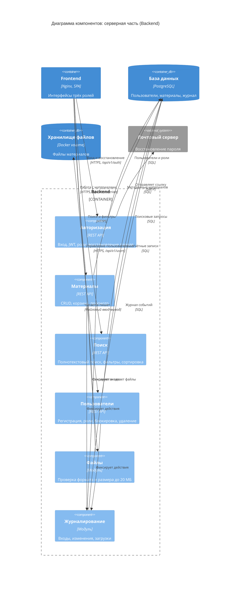

## Уровень 3. Компоненты серверной части

Из каких модулей состоит Backend (функциональные подсистемы из раздела 4.1 ТЗ).

```mermaid
%%{init: {'theme': 'base', 'themeVariables': {'fontFamily': 'Arial, sans-serif', 'fontSize': '16px'}}}%%
C4Component
    title Диаграмма компонентов: серверная часть (Backend)

    Container(frontend, "Frontend", "Nginx, SPA", "Интерфейсы трёх ролей")
    ContainerDb(db, "База данных", "PostgreSQL", "Пользователи, материалы, журнал")
    ContainerDb(files, "Хранилище файлов", "Docker volume", "Файлы материалов")
    System_Ext(mail, "Почтовый сервер", "Восстановление пароля")

    Container_Boundary(backend, "Backend") {
        Component(auth, "Авторизация", "REST API", "Вход, JWT, роли, восстановление пароля")
        Component(materials, "Материалы", "REST API", "CRUD, корзина, просмотр")
        Component(search, "Поиск", "REST API", "Полнотекстовый поиск, фильтры, сортировка")
        Component(users, "Пользователи", "REST API", "Регистрация, роли, блокировка, удаление")
        Component(filestore, "Файлы", "Модуль", "Проверка формата и размера до 20 МБ")
        Component(audit, "Журналирование", "Модуль", "Входы, изменения, загрузки")
    }

    Rel(frontend, auth, "Вход и восстановление", "HTTPS, /api/v1/auth")
    Rel(frontend, materials, "Работа с материалами", "HTTPS, /api/v1/materials")
    Rel(frontend, search, "Поиск и фильтры", "HTTPS")
    Rel(frontend, users, "Управление пользователями", "HTTPS, /api/v1/users")

    Rel(materials, filestore, "Сохраняет и читает файлы")
    Rel(auth, mail, "Отправляет ссылку", "SMTP")
    Rel(filestore, files, "Читает и пишет", "Файловый ввод-вывод")

    Rel(auth, db, "Пользователи и роли", "SQL")
    Rel(materials, db, "Метаданные материалов", "SQL")
    Rel(search, db, "Поисковые запросы", "SQL")
    Rel(users, db, "Учётные записи", "SQL")
    Rel(audit, db, "Журнал событий", "SQL")

    Rel(materials, audit, "Фиксирует действия")
    Rel(users, audit, "Фиксирует действия")
    Rel(auth, audit, "Фиксирует входы")

    UpdateLayoutConfig($c4ShapeInRow="2", $c4BoundaryInRow="1")
```

