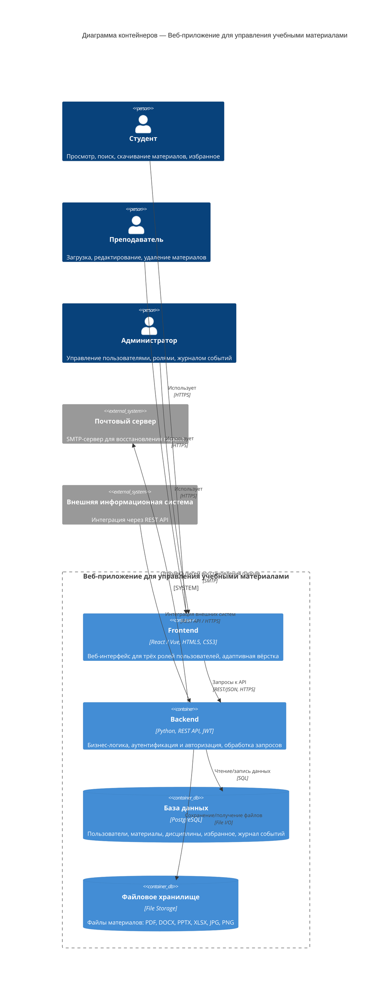

# C4-диаграмма контейнеров
## Веб-приложение для управления учебными материалами

Вставьте блок ниже как есть в файл `README.md` вашего репозитория — GitHub рендерит диаграммы Mermaid нативно, никакой картинки грузить не нужно.

